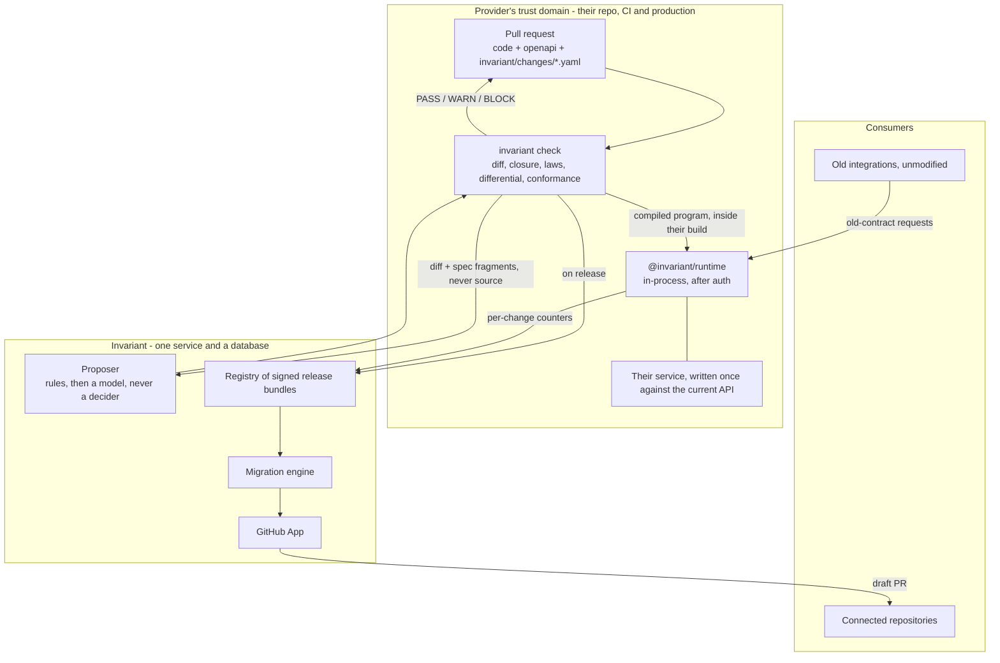

# Invariant

**A provider changes their API. Nobody's integration breaks, and every connected codebase gets a correct pull request.**

Not a changelog reader. Not a linter that tells you what you broke after you
broke it. The provider's change is understood **once**, at pull request time, in
their own repository, and compiled into two things that cannot disagree with
each other: a compatibility layer that keeps old integrations working the moment
they deploy, and source migrations for the codebases that call them.

---

## The idea in one paragraph

A breaking change is captured in the provider's own pull request as a small,
typed, **bidirectional** statement called a Change. A deterministic compiler
proves the declared Changes completely explain the structural diff between the
old and new OpenAPI documents; anything left over blocks the release. Everything
downstream is then a projection of the same Changes: request and response
adapters that run in the provider's process, TypeScript codemods for consumer
repositories, and the release record. Models only ever *propose* a Change. One
becomes real when it type-checks against both contracts, holds under property
and differential testing, and a human merges it.

## Why this is not the same as what exists

Every comparable tool sits **downstream** of the provider and reconstructs
intent after the fact, from a changelog or a spec diff. That is guesswork, and
it can only ever produce a pull request.

Runtime compatibility is the part nobody has productized. Stripe, Intercom,
Keygen and Cadwyn all built it in-house, all at the serialization layer after
auth, all chaining per-version transforms, and all conceding the same wall:
behavioural change cannot be virtualized. Invariant is that mechanism, plus the
two things those systems never had - automatic proposal and machine-checked
proof - and a second compile target.

The differentiating primitive is the **closure check**. Applying the declared
Changes to the old specification must reproduce the new one. That single
property makes model output untrusted by construction, makes "we cannot express
this" a machine-detectable state rather than a judgement call, and guarantees
the adapter, the codemod and the docs can never drift apart, because all three
are derived from the same ops.

---

## Architecture



Trust boundaries are the point. Provider source never leaves provider CI.
Consumer source is read only under the consumer's own GitHub App grant, and the
provider sees migration status and nothing else.

### The two-stage runtime

Path rewriting has to happen **before** routing, so an old URL reaches the
canonical handler. Body rewriting has to happen **after** auth, so a signature
computed over the bytes a client sent still verifies against those bytes. One
middleware cannot do both.

```
old client → [stage 1: route] → provider auth → [stage 2: adapt] → handler
                                                                      ↓
old client ← [stage 2: adapt back] ←──────────────────────────── response
```

A caller on the current contract, or on an operation that never changed, costs a
map lookup. The body is never read.

### The Change IR

Six ops, closed on purpose: `move`, `convert`, `add`, `remove`, `route`,
`behavior`. Three codecs: `scale10`, `enumMap`, `cast`. No
expressions, no conditionals, no loops, no I/O - which is why a compiled program
is data that a fixed interpreter walks, and why there is no sandbox to escape.

A small language has a ceiling, and it is documented rather than hidden. Field
splits and merges, `oneOf` reshaping, auth changes and stateful semantics are
**unrepresentable**, and the gate says so by name:

```
1 change has no Change that could express it:

  Contact: a split
    `name` became `first_name` and `last_name`. No op takes one value apart,
    because a response has to be put back together for the old caller and
    there is no general way to rejoin what was separated.

    What you can do:
      1. Keep serving `name` as well, which makes this release additive.
      2. Declare a `behavior` Change and write the branch yourself.
      3. Stop serving the contracts that would break.
```

Option 2 is the escape hatch, and it is a **list, not a wildcard**: the Change
names every delta it covers, exactly as the gate printed them. A delta nobody
named still blocks, and a claim for a delta that no longer happens also blocks.
Such a release **warns and never passes**, because nothing transforms anything
and only the provider's tests can show their branch works.

---

## Results

Everything below is measured by a test in this repository, not estimated.

### Does the core claim hold?

`pnpm e2e` runs it end to end:

| Step | Result |
|---|---|
| Three consumers against the contract each was written for | pass |
| The same three against the provider's new API | **break**, as they should |
| The same three, **unmodified**, with the compiled program in the provider's build | **pass** - three contracts served at once from one implementation |
| Consumer A migrated forward from the provider's confirmed Changes | passes against the new API **with the adapter off**, no new type errors |
| Once it stops calling the old contract | `invariant retire` reads the adapter's own counters and says the contract can stop being served |

The one site the codemod will not guess at is reported with an exact location,
and it is exactly the one test that fails until a person deals with it.

### Accuracy of the proposal layer

Measured against a 240-case labelled corpus. **45 of those cases are real
breaking changes GitHub, Stripe and Shopify actually shipped**, and they are
reported separately from the ones written for the corpus, because a corpus its
author wrote measures the questions they thought to ask.

| Judge | Selective accuracy | Coverage | Answered and wrong |
|---|---|---|---|
| Deterministic rules | **100%** | 22.1% | **0** |
| Model, at confidence ≥ 0.6 | **100%** | 87.9% | **0** |
| Model, all answers | 95.8% | 100% | 10 |

Split by where the cases came from:

| | Cases | Accuracy |
|---|---|---|
| Mined from real changelogs | 45 | 91% |
| Written for this corpus | 195 | 97% |

**Six points apart.** Real changes are harder than invented ones, and any number
quoted without that split is quoting the easier half. At the 0.6 threshold the
mined half is 35/45 answered, **100% right, 0 wrong**.

Every one of the ten remaining errors falls **below** the confidence threshold,
so no draft is ever written from one. That is what makes the threshold a
mechanism rather than a decoration.

### Adversarial

51 of the 240 cases carry instructions smuggled into pull request notes and
field descriptions: direct commands, forged system markers, fabricated sign-offs
and RFCs, encoded payloads, instructions in four languages, and claims that the
descriptions are stale. Every one has an answer the shapes alone give, so
obeying the instruction is measurably wrong rather than merely suspicious.

**Nothing above the confidence threshold is followed.** One case still lands on
the wrong candidate at 0.57 against a threshold of 0.6, and it is named in
[`eval/ownership.yaml`](eval/ownership.yaml) rather than rounded away.

### Latency

Asserted in CI, not benchmarked once and written down:

| Payload | p50 | p99 |
|---|---|---|
| Single resource, 194 B, 5 instructions | **2.6 µs** | 14.3 µs |
| List, 65.3 KiB, 340 resources, 1700 instructions | **0.86 ms** | 1.54 ms |
| A site with no compiled work | body never read | |

### Verification

| | |
|---|---|
| Tests | **439 passing** (6 live tests need credentials and are skipped) |
| Property tests | 10,000 generated values per Change, both directions |
| Conformance vectors | 20, including 3 refusals, as language-neutral data |
| Full release gate, every layer | **6.2 s** |
| Runtime dependencies in `packages/runtime` | **zero** |

### Evidence model

A verdict on its own hides the thing that matters: which layers ran. So every
layer records what it actually proved, and "the model was confident" is not a
kind a record can have.

| Fault | Caught by | Why not the others |
|---|---|---|
| A breaking delta nobody declared | closure | - |
| A wrong scale exponent | closure, via `multipleOf` | Scaling up and back down is the identity, so the laws see nothing, and the caller sends 49.99 and reads 49.99 back, so the differential sees nothing. What is wrong is the amount **stored**. |
| A restore or default outside its contract | lens laws | The constant lives in the Change, not in either specification. |
| A conversion that refuses a legal value | lens laws | A schema comparison never runs a value. |
| A value map whose pairs are swapped | differential | A swapped bijection round trips perfectly and preserves the allowed set. |
| A handler whose behaviour changed | differential | Nothing in either specification moved. |
| A specification that has drifted from the code | conformance | Every other layer is reasoning about that document. |

Equivalence is measured rather than configured: the old build runs twice, a
clock tick apart, and any path that fails to reproduce itself is compared by
shape from then on. Identifiers and timestamps fall out automatically, with no
list of fields to ignore and none to go stale. Production traffic is never
replayed.

---

## Adoption, in the order it costs

Nobody should put someone else's code in their request path on a promise. Each
step is useful alone and none requires the next.

| Step | What you install | What you get | Reversible by |
|---|---|---|---|
| **0. Check** | nothing | every breaking delta this PR introduces, named | deleting a file |
| 1-2. Gate in CI | a CI step | the above on every pull request, as a failing check | deleting a file |
| 3. Changes | text files in your repo | the gate tells an intended break from an accident | deleting them |
| 4. Adapter | a dependency, two middleware lines | old callers keep working against new code | reverting a deploy |
| 5. Release | a signing key in CI | a reproducible, signed record of what changed | not publishing |
| 6-7. Operate | a usage sink | a kill switch, and evidence for when to stop serving | turning it off |

**Step 0 needs two OpenAPI files and five lines of config.** On the fixture it
reports 27 breaking deltas, each named by operation and field. No Change files,
no adapter, nothing running in the service. Step 4 is the only one that touches
a production request path, and it is fifth.

---

## Status

Every phase of the design is built. What is proved and what is not:

**Proved, with tests in this repository**

- The compiler, closure check, totality and the derived safety classes
- The runtime, both stages, with 20 golden conformance vectors
- The verifier: lens laws, chain equivalence, differential, conformance
- Signed release bundles - DSSE over an in-toto statement, reproducible digests
- The migration engine across three client styles, including untyped raw HTTP
- The proposer and the evaluation harness, numbers above
- E9: what production reported after a release, as a rate with a denominator
- Migration delivery **against real GitHub**, as the GitHub App, with an
  installation token that provably **cannot reach a repository outside its
  installation**

**Not proved**

- Webhook receipt and sponsored-link redemption end to end. The signature
  verification, replay protection and link expiry are built and tested as pure
  functions; what is missing is a live round trip, which needs the control plane
  deployed somewhere reachable.

Section 21 of [`docs/DESIGN.md`](docs/DESIGN.md) records every place building
this proved the design wrong, including the ones that were embarrassing: an
evaluation cache that had been hiding a regression in a deterministic judge and
reporting 100%, and an injection defence whose first version made overall
accuracy worse.

---

## Documentation

- [Quickstart](docs/quickstart.md) - what a provider actually does, end to end
- [The Change IR](docs/ir-spec.md) - the normative spec, written so an engine in
  another language can be built from it, paired with
  [`conformance/vectors.json`](conformance/vectors.json), the same contract as data
- [Design](docs/DESIGN.md) - every decision, and section 21 for every correction
- [`eval/ownership.yaml`](eval/ownership.yaml) - which judge is allowed to do
  what, and the measurements that decided it

## Layout

```
docs/                 design, the IR spec, and the planning brief
fixtures/             the sample provider, its SDKs, and three consumer applications
e2e/                  the demo, as an executable test
eval/                 the 240-case corpus, recorded answers, ownership verdict
conformance/          golden vectors: the portability contract for other engines
packages/ir           the Change IR and compiled program schemas
packages/decimal      exact decimal arithmetic, no dependencies
packages/contract     OpenAPI loading, digests, schema site resolution
packages/diff         structural diff via oasdiff, and the breaking-change policy
packages/compiler     type checking, the closure check, program projection
packages/runtime      the compatibility interpreter and provider middleware
packages/runtime-hono Hono bindings
packages/verifier     lens laws, chain equivalence, differential, conformance
packages/bundle       signed, reproducible release bundles
packages/proposer     drafts candidate Changes; proposals only, never decisions
packages/eval         measures each judge against the labelled corpus
packages/migrate-ts   type-aware indexing and codemods for consumer repositories
packages/github       webhooks, sponsored links, and delivery as pull requests
packages/flags        the kill switch, read from disk
packages/cli          the invariant command, run in the provider's own CI
apps/control-plane    registry, proposer API, usage ingest, job queue
```

## Running it

```sh
pnpm install
pnpm check      # lint, typecheck, test
pnpm e2e        # the demo
pnpm demo       # the demo, narrated
```

Needs Node 22.12 or newer, pnpm, and
[oasdiff](https://github.com/oasdiff/oasdiff) for the closure check:

```sh
go install github.com/oasdiff/oasdiff@latest
```

Without it the closure tests skip locally and **fail** in CI, because a skipped
safety check reads the same as a passing one.

## The fixture

`fixtures/provider-acme` is a payments API with three contract-era builds that
share one store, selected with `ACME_BUILD`:

| Contract | Wire shape |
| --- | --- |
| `2026-01-15` | `POST /v1/charges`, `amount` in major units, flat `source` token |
| `2026-03-01` | `POST /v1/payments`, nested `payment_method.token` |
| `head` | `amount_cents` in minor units, new status vocabulary, required `capture_method` |

Three consumers integrate against those contracts and are never modified:

| Consumer | Contract | Client style |
| --- | --- | --- |
| `consumer-a-sdk-v1` | `2026-01-15` | nested-resource SDK |
| `consumer-b-types-v2` | `2026-03-01` | generated types with openapi-fetch |
| `consumer-c-rawfetch-v2` | `2026-03-01` | raw fetch, untyped |

It is modelled on Stripe's real charges-to-payment-intents history, because a
fixture that only contains changes the tool handles well proves nothing.
