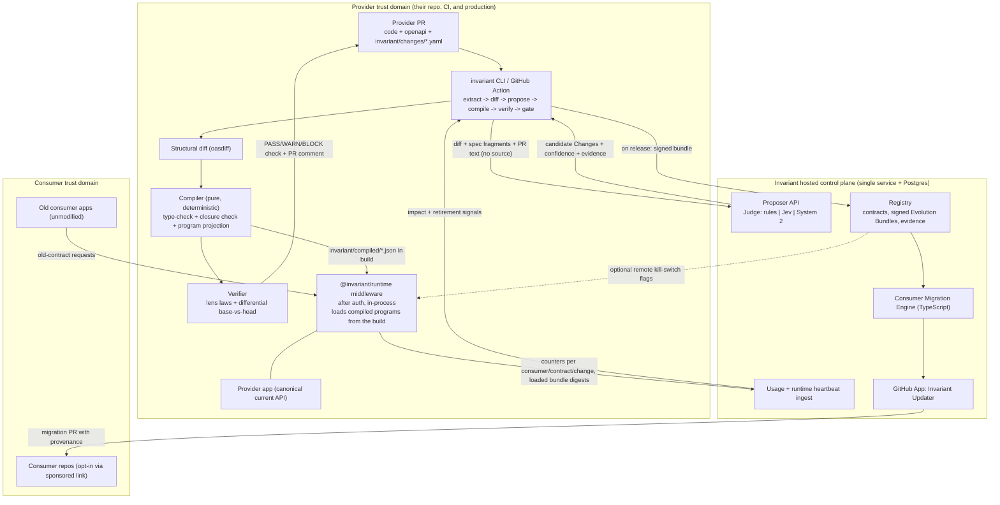
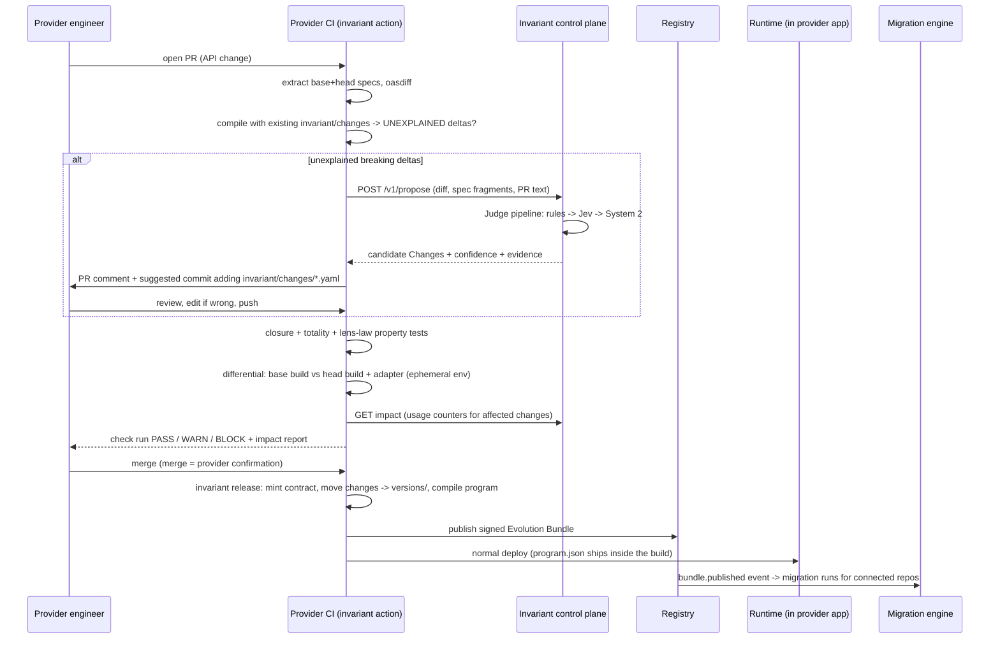
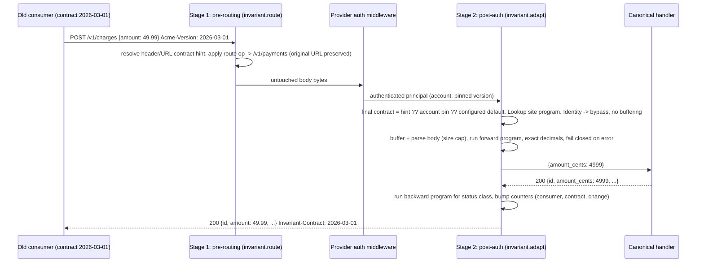

# Invariant - Build-Ready System Design and Implementation Plan

Status: planning output for `INVARIANT_FABLE_PLANNING_BRIEF.md` (2026-09-20). No implementation yet.
Style rule for every file in this project: never use the em dash character, use "-".

---

## 0. Context

YC's Fall 2026 RFS "Self-Maintaining APIs" asks for the layer that connects API providers to customer codebases. Existing entrants (Patchline, Repairo, dependency bots) are downstream and reconstructive: they read a changelog or spec diff after the fact, guess intent, and open a PR. The brief asks for a stronger primitive: the provider's change is understood once, at PR time, and compiled into (a) runtime compatibility so old integrations keep working the moment the provider deploys, and (b) source migrations for connected consumer repos.

This document is the audited design. It keeps the brief's thesis, replaces several of its mechanisms with smaller ones, resolves every open decision, and ends with the exact first build task. On approval, step one is creating the private repo `InvariantApp/Invariant` and committing this design into it.

---

## 1. Executive technical decision (Deliverable A)

### 1.1 The system in one paragraph

Invariant is a compiler and distribution layer for API evolution. A provider's breaking change is captured in the provider's own PR as a small, typed, bidirectional **Change** (a lens over the API contract). A deterministic compiler proves that the declared Changes fully explain the structural diff between the old and new OpenAPI contracts, then derives every downstream target from the same Changes: request and response adapters that run inside the provider's process, TypeScript codemods for consumer repos, SDK metadata, and changelog data. Models (Jev, a System 2 model) only ever *propose* Changes. A Change becomes real only when it (1) type-checks against both contracts, (2) passes lens-law property tests and a base-vs-head differential test in CI, and (3) is merged by the provider through ordinary code review.

### 1.2 The core differentiating primitive

**The closed, verified Change set.** A Change is one declarative op from a tiny catalog (`move`, `convert`, `add`, `remove`, `route`) with forward (old -> new) and backward (new -> old) semantics defined once. The key mechanism is the **closure check**: applying the declared Changes to the old contract's schemas must reproduce the new contract's schemas, modulo additive deltas. Any breaking structural delta left unexplained blocks the release. This single check:

- makes model output untrusted-by-construction (a wrong proposal fails closure, the type-check, or the differential test),
- makes "unrepresentable" a machine-detectable state rather than a judgment call,
- guarantees runtime adapters, codemods, and docs can never disagree, because they are all projections of the same ops.

PR-only tools cannot replicate this because they sit downstream of the provider and have no pre-merge, provider-reviewed source of truth.

### 1.3 What was kept, changed, removed

| Brief proposal | Verdict | Decision |
|---|---|---|
| One canonical artifact compiled to many targets | KEPT | Still the thesis. |
| Separate Semantic IR and Compatibility IR | COLLAPSED | One IR. The semantic statement ("amount is the same money quantity as amount_cents, scaled by 100") *is* the executable lens op plus provenance. A separate compat language would be a second source of truth. The runtime "program" is a pure, cached projection of the Changes against the two specs. |
| API Evolution Bundle as central artifact | DEMOTED | The Change is the primitive. The Evolution Bundle is only the signed, content-addressed release envelope (Changes + contract digests + evidence + compiled program digests). |
| Provider confirmation via a product UI | REPLACED | Git-native, modeled on Changesets. Invariant drafts `invariant/changes/<slug>.yaml` into the provider PR. Confirmation = the provider merging that file through normal code review. No dashboard, no separate approval state, audit trail for free. |
| Hosted reverse proxy as "easiest MVP" | REJECTED | It breaks body-signed auth, adds a hop and an availability dependency, creates data-residency and trust problems, and introduces version skew between proxy and backend during rolling deploys. |
| Data plane deployment | DECIDED | In-process middleware library inside the provider's app, running *after* the provider's auth. Compiled programs ship inside the provider's own build, so adapter and API code deploy and roll back atomically, and the runtime has zero dependency on Invariant's control plane. The same engine is also packaged as a standalone sidecar reverse proxy for non-Node providers (restricted auth modes). Envoy `ext_proc` is the documented scale path, not MVP. |
| WASM / native bytecode | REJECTED for MVP | A closure-tree interpreter over 5 ops on parsed JSON is microseconds per request, trivially auditable, and has no sandbox-escape surface because the IR has no loops, no I/O, and no user code. WASM adds a toolchain and an experimental Envoy dependency for no MVP benefit. The IR is a language-neutral JSON spec with golden conformance vectors so a Rust/Go engine can be certified later. |
| Compatibility graph with flattening algebra | SIMPLIFIED | Contracts form a linear chain per API. The program for `Cn -> current` is the concatenation of per-step op lists, built at compile time, executed in one pass. Concatenation is correct by definition. An optimizing flattener is deferred, and the differential property test `flattened(x) == chained(x)` exists from day one as its future gate. |
| Repair classes A-E | RESTRUCTURED | Replaced by two machine-derived axes: runtime adaptability (`exact`, `declared-lossy`, `none`) and source migratability (`deterministic`, `assisted`, `manual`). The A-E labels are derived display names, not stored judgments. |
| Consumer Usage Profile from traffic telemetry | KEPT, SHRUNK | The adapter is the probe. Each Change op counts applications per (consumer, contract, change). No bodies, no field values, no separate telemetry pipeline. This powers the impact numbers in the release gate and the retirement signal. |
| Contract Fingerprint header | KEPT as identity format, not as a new protocol | Contract id = sha256 of the canonicalized spec, plus a human date label. Identity resolution reuses the provider's existing mechanism (version header, URL prefix, account pin). |
| "Replay historical traffic" verification | REJECTED | Replaced by CI-only differential testing of base build vs head build + adapter in ephemeral environments, with self-calibrating volatile-field detection. Production traffic is never replayed. |
| Jev in the architecture by assumption | CONDITIONAL | All semantic judgments sit behind one `Judge` interface with three implementations (rules, Jev, System 2). The eval harness decides per task which implementation owns it. Jev never gates production by itself in any outcome. |
| Provider-side GitHub App | REMOVED for provider side | Provider integration is a CLI + GitHub Action running in the provider's own CI. Provider source never leaves their CI. The GitHub App exists only for consumer repos. |
| Behavioral changes (class D) | ESCAPE HATCH ADDED | `ctx.invariant.before("<change_id>")` lets provider code branch on contract age, which is how Stripe handles side-effect changes. Invariant records these as `behavior` Changes with no adapter and a mandatory retirement date. |

### 1.4 Landscape check (researched 2026-09-20)

- **The YC RFS text only describes the PR half** ("scan customer codebases, identify affected usages, open a PR"). Runtime compatibility is outside its framing and is our differentiation.
- **Consumer-side fixers are already commoditized**: Patchline (changelog/OpenAPI/SDK feed -> classify -> binding-aware scan -> sandboxed PR, no auto-merge), Repairo (OpenAPI diff -> ts-morph impact map -> typecheck-gated PR), api-doctor, plus several post-RFS weekend clones. All are consumer-installed and reconstruct provider intent after the fact. None has a provider relationship, a canonical artifact, or a runtime leg.
- **Provider-side tools stop at "detect"**: oasdiff, SpecShield, Bump.sh, Speakeasy, Fern. Optic is archived. Stainless was acquired and its hosted generator is being wound down, which leaves provider-side tooling relationships open.
- **Runtime version adapters are proven in-house practice, never productized**: Stripe version-change modules, Intercom, Keygen `request_migrations`, Cadwyn (FastAPI). All run in-process at the serialization layer after auth, all chain per-version transforms, all write handlers once against HEAD, all pin by account with a header override, and all concede the same wall: side-effect and behavior changes cannot be virtualized (Stripe `has_side_effects`, Cadwyn `VersionChangeWithSideEffects`). Our `behavior` Change is that same escape hatch, stated honestly.
- **Project Cambria (Ink & Switch)** independently arrived at a bidirectional lens op set (`rename, convert, add, remove, hoist, plunge, wrap, head, map, in`) and proved "one lens definition -> runtime conversion + types + schema". It was a research prototype, hand-authored, with no verification story. Invariant's Change IR is a deliberately smaller lens set plus what Cambria lacked: automatic proposal, closure against real specs, property and differential verification, and a second compile target (source codemods).
- **Stripe's stated reason for never auto-upgrading accounts** is that it cannot observe which fields a consumer reads. Invariant gets that exact datum two ways: per-change adapter counters at runtime and type-checker reference counts from connected repos.
- **OpenAPI Overlay 1.1** is a document patch format (JSONPath target + update/remove/copy, no rename, zero-match targets silently succeed). It cannot carry bidirectional value semantics. Decision: not used as the IR. An Overlay export of the spec delta is a trivial later add-on.
- **Nobody ships a signed API-change artifact.** We use DSSE with an in-toto Statement whose predicate type is `https://invariant.dev/evolution-bundle/v1`, so existing attestation tooling can verify it.

Lessons adopted from prior art: keep the "each step sees the world as it was when written" invariant (our per-step ops are compiled against that step's two contracts only), version error bodies explicitly (Cadwyn is the only system that does), make shape transforms reusable across channels (Keygen reuses them for webhooks, which is our first post-MVP target), and keep the number of Changes low through review (Stripe's API review gate is our PR-merge gate).

### 1.5 How we avoid becoming a gateway company

We never operate customer traffic. The runtime is a library and an optional self-hosted sidecar. What Invariant hosts is small: a registry of contracts and bundles, the semantic proposer API, usage counter ingestion, and the consumer migration service.

---

## 2. Architecture (Deliverable B)



Trust domains are explicit: provider source stays in provider CI, consumer source is only ever read by the migration service under the consumer's GitHub App grant, and the provider sees only aggregate migration status.

---

## 3. Core formats (Deliverables E and G)

All schemas are defined once in `packages/ir` with a TypeScript-first schema library, exported as JSON Schema, and versioned with an `irVersion` integer. Unknown op kinds or unknown fields are a hard validation error (no JSON soup, no silent forward-compat).

### 3.1 Contract

A Contract is an immutable normalized OpenAPI 3.x snapshot.

```yaml
contract:
  api: acme-payments
  label: "2026-09-20"            # human label, date based, minted only when a release has >= 1 non-additive change
  digest: sha256:9f2c...          # sha256 over RFC 8785 canonical JSON of the bundled, dereferenced, normalized spec
  parent: sha256:41ab...          # linear chain in MVP
  spec_ref: invariant/contracts/2026-09-20.openapi.json
```

Normalization: bundle external refs, keep internal `$ref`s (needed for schema-scoped Changes), strip descriptions/examples from the digest input only (they do not affect the wire contract), sort keys. Additive-only releases do not mint a new Contract, they advance the current one in place (new digest, same label lineage is recorded as `revisions[]`).

### 3.2 Change (the single IR)

```yaml
irVersion: 1
id: chg_amount_minor_units          # stable slug, unique per API
summary: "Payment.amount (major units, decimal) becomes Payment.amount_cents (minor units, integer)"
scope:
  schema: "#/components/schemas/Payment"   # schema-scoped: applies everywhere Payment is referenced
  # alternatively: operation: payments.create, location: body|query|path|header, direction: request|response|both
ops:
  - op: move
    from: /amount
    to: /amount_cents
  - op: convert
    path: /amount_cents
    codec: { kind: scale10, exponent: 2, newType: integer, oldType: decimal, onInexact: reject }
assertions:                          # semantic claims, separate from structural facts
  same_concept: true
  side_effects_unchanged: true
provenance:
  structural: [ { tool: oasdiff, ids: [request-property-removed, response-property-removed, ...] } ]
  proposed_by: { judge: jev, model: "<id>", confidence: 0.97, question_set: v3 }
  escalations: []
  confirmed_by: { kind: provider-merge, commit: "<sha>", reviewer: "<login>" }   # filled at release
derived:                             # computed by the compiler, never hand-written
  runtime: exact                     # exact | declared-lossy | none
  source: deterministic              # deterministic | assisted | manual
  display_class: A
```

**Op catalog, irVersion 1 (complete list):**

| Op | Forward (old -> new), used on requests | Backward (new -> old), used on responses | Exactness |
|---|---|---|---|
| `move {from, to}` | relocate value between JSON Pointer paths (covers rename, nest, unnest) | inverse move | exact |
| `convert {path, codec}` | apply codec.forward | apply codec.backward | per codec |
| `add {path, default}` | new required request field: insert `default` if absent | response: drop the field | `declared-lossy` unless provider asserts the default equals prior implicit behavior |
| `remove {path, restore}` | request: drop field | response: synthesize `restore` constant or `restore.copyOf` an existing sibling | `declared-lossy` unless `copyOf` |
| `route {from:{method,path}, to:{method,path}, params}` | rewrite method + path template, remap path params | none needed (responses are keyed by resolved operation) | exact |
| `behavior {flag}` | no adapter. Marks a provider-coded branch via `ctx.invariant.before(id)` | same | runtime: none |

**Codec catalog (closed):** `scale10{exponent,onInexact: reject|half-even}`, `enumMap{pairs, bijective: must be true in v1}`, `cast{string<->integer, string<->decimal, integer->decimal}`, `wrapArray/unwrapSingle`. Every codec declares its domain, range, and whether forward and backward are total. No expressions, no conditionals in v1. Closed predicates (CEL-style) are deferred until a real case needs them.

**Path language:** JSON Pointer with a single wildcard segment `*` for array items (`/items/*/amount`). Nothing else. Pointers are resolved against schemas at compile time, so an op that targets a path absent from the schema is a compile error.

**Explicitly unrepresentable in v1 (compiler reports `none`, gate blocks unless a `behavior` Change covers it):** split/merge of fields, oneOf/anyOf/discriminator reshaping, values derived from external lookups, opaque cursor contents, auth scheme changes, multipart/binary/streaming bodies, non-bijective enum maps on request paths.

### 3.3 Compiler type system and closure check

1. Load old and new Contract. Resolve each Change's scope to concrete `(operationId, location, direction, status)` sites by walking `$ref` usage (allOf flattened first).
2. Type-check each op against the old schema at that site. Each op is also a **spec transformer**: `move` relocates the subschema, `scale10` maps `number` to `integer`, `route` rewrites the path item, etc. Applying all Changes to the old spec yields a **predicted spec**.
3. **Closure = `oasdiff(predicted spec, actual new spec)` contains no breaking entries.** We do not write our own schema-compatibility classifier: oasdiff's 755 checks do that work. Residual entries are the `UNEXPLAINED` list -> gate BLOCK. The set of oasdiff check ids treated as breaking is pinned in `packages/diff/policy.ts` (all ERR, plus WARN ids such as `request-property-removed`, because oasdiff's levels express spec uncertainty, not our semantics). oasdiff has no rename detection (renames appear as remove + add), which is exactly the gap the proposer fills.
4. **Totality:** forward program must be total over the old request schema, backward program total over the new response schema (every status code with a declared schema). Partial codecs must carry `onInexact`.
5. Emit per-site programs.

### 3.4 Compiled program (runtime input, projection only)

```json
{
  "irVersion": 1,
  "api": "acme-payments",
  "current": "sha256:9f2c...",
  "bundleDigest": "sha256:77aa...",
  "contracts": {
    "2026-03-01": {
      "routes": [ { "from": ["POST","/v1/charges"], "to": ["POST","/v1/payments"], "params": {} } ],
      "sites": {
        "payments.create": {
          "request":  { "body": [ ["move","/amount","/amount_cents","chg_amount_minor_units"], ["scale10","/amount_cents",2,"reject","chg_amount_minor_units"] ] },
          "response": { "2xx": { "body": [ ["scale10inv","/amount_cents",2,"chg_amount_minor_units"], ["move","/amount_cents","/amount","chg_amount_minor_units"] ] } }
        }
      }
    }
  }
}
```

Programs for `Cn -> current` are the concatenation of each chain step's ops (requests in chronological order, responses in reverse). Sites absent from the map are identity and are never buffered or parsed. Each instruction carries its `change_id` for counters and for the per-change kill switch.

### 3.5 Evolution Bundle (release envelope)

```yaml
bundleVersion: 1
api: acme-payments
from: sha256:41ab...   to: sha256:9f2c...   label: "2026-09-20"
source: { repo: acme/payments-api, commit: <sha>, pr: 482 }
changes: [ <Change>, ... ]                 # full, with provenance and confirmations
structural: { tool: oasdiff, version: x, breaking: [...], additive_count: 41 }
evidence: [ <VerificationEvidence>, ... ]  # see section 6
compiled: { program_digest: sha256:..., sdk_map_digest: sha256:..., recipes_digest: sha256:... }
gate: { result: PASS|WARN|BLOCK, policy_digest: sha256:..., unexplained: [] }
rollout: { retire_after: null, behavior_flags: [] }
```

Number rule: RFC 8785 canonicalization re-serializes numbers the ECMAScript way, so the IR allows only safe integers as JSON numbers. Every decimal literal (defaults, restore constants) is encoded as a tagged string (`{ "$decimal": "0.50" }`). Canonicalization is applied to artifacts only, never to API payloads.

Envelope: DSSE wrapping an in-toto Statement (predicate type `https://invariant.dev/evolution-bundle/v1`), signed with Ed25519 (`node:crypto`) over the RFC 8785 canonical JSON. The digest of the payload is the bundle id. Builds are reproducible: same specs + same Change files => same digest, which the registry verifies on publish.

---

## 4. Provider flow (Deliverable D)

### 4.1 Provider repo layout

```
invariant.yaml                      # api id, spec source, start/seed commands, identity strategy, gate policy
invariant/changes/*.yaml            # pending Changes (one per logical change, added in the PR that makes it)
invariant/versions/<label>.yaml     # released: ordered list of Changes for that contract step
invariant/contracts/<label>.openapi.json
invariant/compiled/program.json     # build output, loaded by the runtime (generated by `invariant compile`, marked auto-generated)
invariant/scenarios/*.yaml          # optional differential test scenarios
```

`invariant.yaml` spec source is either a committed file or a command (`spec: { command: "pnpm gen:openapi", out: openapi.json }`) so code-first providers are supported. OpenAPI is required for the MVP. Stale or wrong specs are caught by the differential verifier, which validates real responses from the running head build against the new Contract.

### 4.2 Sequence



### 4.3 Gate policy (the whole policy surface in the MVP)

| Condition | Result |
|---|---|
| Unexplained breaking delta | BLOCK (not configurable) |
| Closure, totality, lens-law, or differential failure | BLOCK (not configurable) |
| Change with `runtime: none` and no `behavior` flag, while usage counters show active consumers on affected contracts | BLOCK (configurable to WARN) |
| `declared-lossy` Change | WARN (configurable to BLOCK) |
| Proposal below confidence threshold that the provider has not yet touched | WARN with "needs explicit attention" marker |
| Additive only | PASS |

### 4.4 Lifecycle compression

The brief's 17 steps compress to 6 states per Change: `proposed -> pending (in PR) -> released (in a bundle) -> active (counters > 0) -> idle (counters 0 for N days) -> retired (removed from program at next compile)`. Retirement is a generated PR in the provider repo that deletes the Change from the active chain once all consumers pinned below it are gone.

---

## 5. Runtime (Deliverable C and brief section 16)

### 5.1 Request sequence



Two stages exist because path rewriting must happen before routing while body mutation must happen after auth (so body-HMAC verification sees original bytes). Both stages are one import: `const inv = invariant({ program, identity })`, then `app.use(inv.route)`, `app.use(auth)`, `app.use(inv.adapt)`.

### 5.2 Decisions for every issue in brief section 16

| Issue | Decision |
|---|---|
| 16.1 Auth and signing | In-process mode: transforms run after provider auth, so bearer, API key, and body-HMAC all work. Signature schemes that cover the path (SigV4 style) are excluded when a `route` op applies (compiler warns). Sidecar mode supports only auth that does not cover body or path. |
| 16.2 Idempotency | Programs are pure and deterministic, so identical old requests map to identical canonical requests. Idempotency-Key and all unlisted headers pass through untouched. The runtime never retries or replays. |
| 16.3 Side effects, shadow testing | No production replay or shadowing, ever. Verification happens only in CI ephemeral environments (section 6). |
| 16.4 Precision and money | `scale10` is a decimal-point shift on the digit string, never float math, so `4.35` becomes exactly `435`. The text comes from `String(value)`, which recovers the caller's exact decimal for every number a double represents. **Measured correction to the original plan:** parsing with Node's source-text reviver to keep digits beyond double precision costs 1.9x a plain parse on a number-heavy body, because any reviver leaves V8's fast path, and it buys precision the provider's own `JSON.parse` would lose one step later. It is therefore opt-in (`numbers: "preserve"`) rather than the default. Property tests check both modes against a bigint oracle. Inexact input (49.999 with exponent 2) follows `onInexact` (`reject` -> 400 in the old contract's error shape). Integers beyond the safe range on touched paths stay as digit strings end to end. Currency-dependent exponents are out of v1 (the provider declares the supported exponent, and the differential test proves it on their fixtures). |
| 16.5 Pagination cursors | Opaque values pass through. Ops cannot target inside strings. List envelopes are handled with the `*` wildcard. |
| 16.6, 16.7 Streaming, binary, multipart, WS, SSE, gRPC | Excluded. Non-JSON content types on a site that has a program -> compile error at release time, not a runtime surprise. |
| 16.8 Error semantics | Backward programs are keyed by status class and apply to declared error schemas too. Providers can mark an error's field pointer (`x-invariant-error-param`) so `amount_cents` in a validation error is mapped back to `amount`. Status code and rate-limit semantics are untouched in v1. A status code change is `behavior`. |
| 16.9 Stateful semantics | Not representable, by design. Closure fails or the differential scenario fails, and the change must be a `behavior` Change with provider code. |
| 16.10 Latency and buffering | Buffer only sites with non-identity programs. Body cap 1 MiB default (configurable). Over cap on an adapted site -> 413 in fail-closed mode. No network calls on the hot path. **Measured budget** (`packages/runtime/src/bench.test.ts`, asserted in CI): a site with no compiled work does not read the body at all; a single 194-byte resource with 5 instructions is p50 2.6 us / p99 14 us; a 65 KiB list of 340 resources carrying 1700 instructions is p50 0.86 ms / p99 1.50 ms. The original plan's "p99 < 1 ms at 64 KiB" was optimistic for large list envelopes and is corrected here. |
| 16.11 Privacy | The runtime persists nothing. Counters contain consumer key hash, contract label, change id, count, last-seen. No paths' values, no bodies. Sink is pluggable (stdout, OTel, HTTPS batch to control plane). |
| 16.12 Rollback | Primary: adapter ships in the provider build, so reverting the deploy reverts the adapter atomically. Secondary: kill switch file/env/optional remote flags with three granularities (global, contract, change). "Off" means the affected site returns an explicit `invariant_contract_unsupported` error, never silently passes mis-shaped data. Remote flags are cached on disk with last-known-good semantics and a bounded poll, and are optional. |

Request transform failure -> 4xx/5xx before the handler runs (no side effect). Response transform failure after a successful side effect -> 502 with `Invariant-Error-Id`, the raw canonical response is never leaked in the wrong shape, idempotency keys make the consumer retry safe. Totality checks plus property tests make this path rare. Its rate is an SLO (section 11).

### 5.3 Contract identity (brief section 10)

- Identity is resolved by a provider-supplied strategy list, first match wins: `header(name)`, `urlPrefix(map)`, `principal(fn)` (account-pinned version from the provider's own store, Stripe model), `default(label)`.
- Onboarding: the spec at onboarding time becomes the baseline Contract. All existing consumers are pinned to baseline. History before onboarding is out of scope.
- New accounts pin to current at first authenticated request (provider stores the pin, Invariant ships a 10-line helper).
- Generated SDKs send the contract label header baked in at SDK generation, so merging a migration PR that bumps the SDK also advances the consumer's effective contract.
- Spoofing: a contract label only selects among public, pure shape adapters. It must never gate authorization, and the docs and a lint in `invariant check` enforce that `behavior` flags are not used for authz. Unknown label -> 400. Missing everything -> `default`.
- Identity vs usage are separate tables: `ContractIdentity` says what a consumer expects, per-change counters say what they actually exercise.

---

## 6. Verification and evidence model (Deliverable I)

"Model confidence is high" never appears as evidence. Evidence kinds, each a record `{kind, subject: change_id|bundle, inputs_digest, tool, result, artifacts}` stored in the bundle:

| Layer | What it proves | Where |
|---|---|---|
| E1 schema-validate | Change files are well-formed irVersion 1 | CLI |
| E2 type-check + closure | Ops explain the entire breaking diff | compiler |
| E3 totality | Programs cannot hit an undefined case on schema-valid input | compiler |
| E4 lens laws (property tests) | For `exact` Changes: `backward(forward(x)) == x` for generated old-schema values and `forward(backward(y)) == y` for new-schema values. For lossy: the declared loss is the only difference. Generators come from the Contract schemas | verifier, fast-check |
| E5 chain equivalence | Concatenated `Cn -> current` program equals step-by-step application | verifier |
| E6 differential base-vs-head | Observable behavior of `base build` equals `head build + adapter` for old-contract scenarios | verifier, provider CI |
| E7 conformance | Head build responses validate against the new Contract (catches stale specs) | verifier |
| E8 provider merge | A human with repo write access reviewed the Change | git |
| E9 runtime counters | Post-deploy: transform error rate, unsupported-contract rate | runtime |

**E6 in detail (defines the brief's `≈`):** `invariant.yaml` gives `start` and optional `seed` commands. The verifier boots base (git worktree of the merge base) and head on ephemeral ports with fresh state, then runs scenarios: ordered request lists with captures (`create -> retrieve -> list`). Scenario sources: provider-written YAML, OpenAPI examples, and auto-generated CRUD chains from schema-derived values. It runs base twice first: any response path that differs between two base runs is marked volatile (ids, timestamps) and compared by type and presence only. Then base vs head+adapter must match on status, non-volatile body paths, and an allowlist of headers. Equivalence is therefore per-operation and empirical, not byte equality.

**Risk tiers:** `exact` Changes need E1-E5, E8, and E6 if the provider configured `start`. `declared-lossy` additionally needs an explicit `loss_acknowledged: true` in the Change file. `behavior` Changes need E8 and a scenario that exercises both branches.

**Canary:** kill-switch granularity doubles as canary control (`enable change X for contract Y for consumers in list or percent`), evaluated locally from a flags file. This is a stretch item inside Phase 3, off by default.

---

## 7. Jev design and evaluation harness (Deliverable H)

Facts verified against docs.typesafe.ai on 2026-09-20: `@typesafe-ai/sdk` (Node >= 20), `POST /v1/systemone`, primitives `choice` / `score` / `noul`, one `state` + many independent questions evaluated in parallel per request, full probability distributions returned, `jev-1.13.0` at $0.042 per Mtok input with free output, ~100-300 ms typical, 64k tokens per request (32k for state + longest question), no seed/temperature, no batch endpoint, measured run-to-run std dev ~0.01, vendor-documented weaknesses: arithmetic, counting, dates, indirection, large irrelevant state, adversarial content in state.

### 7.1 Role (what Jev may and may not own)

Jev is a **proposal ranker and attention router** inside the control plane's proposer. It never touches runtime, never authorizes a release, and never emits free-form content. Its answers select among candidates that deterministic code enumerated, so the worst possible outcome of a wrong or prompt-injected answer is a wrong *draft* Change, which then fails closure, fails the differential test, or is rejected in code review.

Division of labor, fixed by the vendor's own limitations list:

| Judgment | Owner |
|---|---|
| Structural delta detection, type compatibility, candidate enumeration | deterministic (oasdiff + compiler) |
| Scale factor, numeric relation, `_cents`/`_ms` suffix conventions, enum value pairing by exact/normalized match | deterministic rules (Jev is documented as weak at numbers) |
| T1 field alignment: is removed field A the same business concept as added field B? | Judge (rules vs Jev vs S2, per harness) |
| T2 change-family classification for an aligned pair | Judge |
| T3 evidence sufficiency: does the PR text/spec description actually state this mapping? (observed vs inferred) | Judge |
| T4 behavior-change suspicion: does the PR text or description suggest side-effect or semantic change beyond shape? | Judge |
| T5 enum pairing when names are not lexically matchable | Judge |
| T6 raw-HTTP call-site to operation matching (consumer side) | Judge |
| Drafting a Change for families outside rules coverage, human-readable summaries, assisted source repair | System 2 only |

### 7.2 Question primitives (one request per unexplained removed field)

State is kept minimal (vendor warns about context rot): the removed field, its candidates, and trimmed PR text. Never the whole spec.

```ts
const state = {
  operation: "payments.create (POST /v1/payments)",
  removed: { name: "amount", type: "number", description: "Charge amount in dollars", location: "request.body" },
  candidates: {
    c1: { name: "amount_cents", type: "integer", description: "Amount in the smallest currency unit" },
    c2: { name: "application_fee", type: "integer", description: "Platform fee in cents" },
  },
  pr: { title: "...", body_excerpt: "..." },          // untrusted text, size capped
  rule_hints: { c1: "name stem match, numeric->integer, suffix _cents implies scale10^2" },
};
const questions = {
  // T1: one 3-level Score per candidate (entity-alignment pattern: levels ARE the actions)
  align_c1: score("How does `removed` relate to `candidates.c1` as a business concept?", [
    "They represent different business concepts.",
    "They are related but may not be the same quantity or entity. A reviewer should decide.",
    "They represent one and the same business concept, possibly renamed, moved, or re-encoded.",
  ]),
  align_c2: score(/* same */),
  // T1b: relative pick including an explicit no-match option
  successor: choice("Which candidate, if any, replaces `removed`?", { c1: null, c2: null, none: "No candidate replaces it. The capability was removed or changed in kind." }),
  // T2
  family: choice("Assuming `removed` was replaced by the best candidate, what kind of change is it?", {
    rename: "...", relocation: "...", representation_change: "...", enum_remap: "...", type_change: "...",
    split_or_merge: "...", semantic_replacement: "...", removal: "...", unknown: "...",
  }),
  // T3, T4
  mapping_stated: noul("Does `pr` or any description explicitly state that `removed` is replaced by a candidate?"),
  behavior_change: noul("Does `pr` describe a change in side effects, timing, or business rules for `operation`, beyond field shape?"),
};
```

All questions for one removed field go in one request (speculative fan-out: `family` is asked before `successor` is known, and code reads it only if relevant). Requests for different removed fields run concurrently (pool of 6). Every response stores the full `probabilities`, the resolved `model` id, and `usage`. The model id is **pinned** (`jev-1.13.0`, never `jev-latest`) because thresholds are version-coupled.

### 7.3 Pipeline, thresholds, escalation, disagreement

```
rules (deterministic) -> exact structural+lexical match?  -> draft Change, provenance=rules
        | no
Jev T1..T5 -> align score level 2 AND successor agrees AND confidence >= tau_hi[task]  -> draft Change, provenance=jev
        | level 1, or confidence in [tau_lo, tau_hi), or Jev/rules disagree
System 2 (structured output constrained to the Change JSON Schema, candidates only) -> draft, provenance=s2, marked "needs explicit attention"
        | S2 abstains or output fails schema/closure
UNEXPLAINED -> provider authors the Change by hand (CLI scaffolds it) or declares `behavior`
```

- Initial thresholds `tau_hi = 0.9`, `tau_lo = 0.5` are placeholders. The harness sets real values per task from the selective-risk curve, and they live in a checked-in `eval/thresholds.yaml` keyed by model id.
- **Disagreement rule:** structural evidence always wins. A Jev-preferred candidate that is type-incompatible under every codec in the catalog is discarded before ranking. If Jev is confident and rules are confidently opposite, the case escalates to S2 and is auto-filed as a regression fixture.
- `behavior_change > tau_b` never blocks by itself. It adds a required acknowledgment line to the Change file (`side_effects_unchanged: true` must be set by a human).
- No separate Noul/Choice invariants are assumed (vendor documents that a Noul and its negation need not sum to 1). Each question has its own threshold.
- Confidence only ever modulates *how loudly the PR comment asks for attention*. Every Change is still merged by a human in the MVP. "Auto-accept without review" is a deferred policy flag that can only be enabled per task if the harness shows accuracy at `tau_hi` >= 99.5% with a lower confidence bound over >= 500 cases.

### 7.4 Evaluation harness (`packages/eval`, built in Phase 2)

**Dataset format** - one YAML file per case under `eval/corpus/<family>/<id>.yaml`:

```yaml
id: repr-amount-cents-001
source: synthetic | mined:<url> | regression:<bundle_or_issue>
tags: [representation_change, money]            # plus ambiguous, adversarial, missing_info, non_automatable
old: { operation: ..., schema_fragment: {...} }
new: { operation: ..., schema_fragment: {...} }
context: { pr_title: ..., pr_body: ..., descriptions: true }
labels:
  alignment: [ { removed: /amount, successor: /amount_cents } ]   # or successor: none
  family: representation_change
  same_concept: true
  reversible: true
  info_sufficient: true
  runtime: exact            # expected derived class
  source: deterministic
  expected_change: { ops: [...] }     # gold Change, must pass closure against old/new
  should_escalate: false
```

Corpus v0: >= 240 cases, >= 15 per family across the 12 families listed in the brief, of which >= 25% tagged `ambiguous` or `adversarial` (decoy candidates with similar names, misleading descriptions, prompt-injection strings inside descriptions, renamed-but-different-concept pairs). Sources: hand-built synthetic cases, and real changes mined from public versioned changelogs (Stripe, GitHub REST, Shopify, Twilio API version notes). Every gold `expected_change` is machine-validated by the compiler so labels cannot rot.

**Runner:** `pnpm eval run --judge rules|jev|s2|hybrid --tasks T1,T2 --repeats 5`. Judges implement one interface:

```ts
interface Judge { id: string; answer(task: TaskInput): Promise<{ answer: Label; distribution?: Record<string, number>; abstained: boolean; latencyMs: number; inputTokens: number; costUsd: number; model: string }> }
```

Responses are cached on disk keyed by `(judge, model, task input digest, repeat index)`, so CI replays recorded answers deterministically and for free. Live re-recording is a manual or nightly job.

**Metrics (per task, per family, per tag):** accuracy, FPR, FNR, macro-F1, expected calibration error + reliability table (10 bins), accuracy at confidence >= tau vs overall accuracy (the brief's key safety question), risk-coverage curve and AURC for abstention quality, threshold-straddle rate across repeats (instability), p50/p95 latency, cost per 1k cases, questions per request and tokens per question (batching efficiency).

**Ownership rule, machine-checked in `eval/ownership.yaml`:** Jev owns task T only if, on the held-out split: (a) selective accuracy at the chosen tau is >= the task's target (T1: 99% at >= 60% coverage), (b) it beats the rules baseline on the cases rules abstain on by a margin with non-overlapping 95% bootstrap intervals, and (c) it is within 2 points of S2 selective accuracy at < 10% of S2 cost or latency. Fail (b) -> rules own the task. Fail (a) or (c) -> Jev is demoted to candidate ranker/escalation signal and S2 owns the decision. The report states the verdict per task, and the proposer reads ownership from that file.

**CI:** rules-judge eval runs on every PR (deterministic, free). Cached Jev/S2 evals run on every PR touching `packages/proposer` or `eval/`. Any metric regression beyond tolerance in `eval/thresholds.yaml` fails CI. Every production disagreement, provider-edited proposal, or closure failure of a proposed Change is exported by `invariant eval capture` into a new corpus case (regression fixture loop).

---

## 8. Consumer Migration Engine (Deliverable J) - built natively, no Relay lineage

### 8.1 Why it is structurally better than changelog-driven tools

Input is the Evolution Bundle: exact ops, exact schema sites, provider-confirmed semantics, and an **SDK symbol map**. Nothing is rediscovered. Every op in the catalog has one hand-written, tested codemod, so the common path contains no model at all.

### 8.2 SDK symbol map (compiled artifact)

For each Contract, the compiler emits a map from IR sites to TypeScript declaration symbols for each supported client style:

```json
{ "site": "schema:Payment/amount",
  "symbols": [
    { "style": "openapi-typescript", "module": "@acme/api-types", "path": "components.schemas.Payment.amount" },
    { "style": "acme-sdk", "module": "@acme/sdk", "path": "Payment.amount" },
    { "style": "acme-sdk", "module": "@acme/sdk", "path": "PaymentCreateParams.amount" } ] }
```

### 8.3 Pipeline

1. **Detect**: read `package.json` + lockfile for the provider's SDK/types package and version -> the repo's current Contract. Raw HTTP detection: string/template literals matching the API base URL or path templates.
2. **Index (type-aware, deterministic, out-of-process)**: TypeScript 7 (native) shipped without a programmatic API (promised for 7.1+), and ts-morph only works on the TS 6 JS compiler. So the indexer is a separate worker process with a JSON contract: input `{repoDir, symbols[]}`, output a hit list `[{file, start, end, role, symbol, changeId}]`. It runs ts-morph on **our own pinned TS 6.x**, independent of whatever TypeScript version the consumer uses, and is read-only. When the TS 7 API or LSP lands, only this worker is swapped. Inside the worker: load the project with the TypeScript language service. For every symbol in the map touched by the bundle's Changes, run **find-all-references on the declaration inside the SDK's `.d.ts`**. This returns every object-literal property, property access, destructuring binding, and type reference across the repo, through aliases, spreads, and helper functions, with zero heuristics. This is the core trick: the type checker does the blast-radius analysis.
3. **Plan**: each reference is classified by syntactic role (`write-literal`, `write-expression`, `read-access`, `destructure`, `type-position`, `dynamic/unknown`).
4. **Rewrite (deterministic codemods per op x role)**, format-preserving by construction: codemods never reprint an AST. They emit byte-range text edits at the exact ranges from the hit list, applied back-to-front by a small splice applier, so untouched bytes are untouched and no formatter noise appears in the PR:
   - `move`: rename property keys, accesses, destructuring (keeping local binding names via `{ amount_cents: amount }` when that minimizes the diff).
   - `convert scale10`: numeric literal -> exact literal computed with decimal string math (`49.99` -> `4999`). Non-literal write -> wrapped with the SDK-exported exact helper (`toMinorUnits(expr, 2)`), reads -> `fromMinorUnits(expr, 2)`. The helpers ship in the SDK so no float math is ever inlined.
   - `enumMap`: literal replacement, union type updates.
   - `add`: insert property with the declared default and a provenance comment. If the Change has no valid default (needs-information), insert nothing, and emit a targeted TODO issue/PR section instead.
   - `route`: SDK users get it free from the SDK bump. Raw HTTP: rewrite matched URL literals.
   - Dependency bump of the SDK/types package to the version generated from the new Contract (which also advances the contract header).
5. **Assisted repair (System 2, bounded)**: only for references classified `dynamic/unknown` or where step 6 fails. The model receives the Change, the failing diagnostics, and the enclosing function only. Output is a patch restricted to the files already in the plan. Every model-authored hunk is labeled in provenance. If it still fails, the site is reported as manual with exact location, never silently skipped.
6. **Verify**: install with lifecycle scripts disabled, run the type checker over the patched project: zero new diagnostics relative to the pre-patch baseline. Tests are never executed on Invariant infrastructure (arbitrary code). The PR is opened as **draft**, the consumer's own CI runs, and the GitHub App promotes it to ready on green checks. For local fixtures the harness runs tests directly.
7. **PR with provenance**: body is generated from the bundle: change id, contract step, op, provider confirmation, evidence ids, per-hunk authorship (`codemod` or `model`), sites needing manual action. A machine-readable `invariant-provenance.json` is attached as a PR comment block.

Raw HTTP call sites are inherently lower confidence (untyped). They are matched by URL literal + enclosing `JSON.stringify`/body object literal, judged through the `Judge` interface ("does this call target operation X?"), rewritten by the same codemods, and always flagged for review.

### 8.4 Breaking changes vs new features

Three separate bundle sections with different engines: `changes` (compat + deterministic migration, above), `behavior` (guided migration notes only), `capabilities` (new feature descriptions with applicability hints). The MVP implements only `changes` and renders `behavior` as PR text. `capabilities` is schema-reserved and otherwise deferred. No automatic rewriting of business behavior, ever.

---

## 9. Consumer distribution and permissions (brief section 19)

- **GitHub App "Invariant Updater"** is the right first mechanism: per-repo install, short-lived installation tokens, native PR + checks UX. Permissions: `metadata: read`, `contents: write`, `pull_requests: write`, `checks: read`. No `workflows`, no `actions`, no org-level permissions. Events: `installation`, `installation_repositories`, `check_suite`, `pull_request`.
- **Sponsored link flow**: the provider dashboard-less MVP exposes `invariant link create --consumer <account_id>` which mints a signed, expiring URL. The consumer opens it, installs the App on chosen repos, and the installation is bound to `(provider api, consumer account id)`. That binding lets counters and migrations be reconciled per consumer.
- **Provider never receives source.** Provider-visible data per consumer: `connected: yes/no`, `migration status per change: pending | pr-open | merged | manual-needed`. Nothing else.
- Commits are created through the Git Data API from a shallow clone in an ephemeral workdir, deleted after the run. No source is persisted, only file paths + hunk hashes in `MigrationRun`.

---

## 10. Domain model and interfaces (Deliverables E and F)

### 10.1 Entities (Postgres, control plane). Git in the provider repo is the source of truth for Changes. The registry is an index plus the consumer-facing distribution point.

| Entity | Key fields | Persisted? |
|---|---|---|
| `Provider` | id, name, publisher_public_keys[] | yes |
| `Api` | id, provider_id, slug, identity_strategy_doc, gate_policy | yes |
| `ContractSnapshot` | digest (pk), api_id, label, parent_digest, spec (jsonb, compressed), created_from_commit | yes, immutable |
| `ContractIdentity` | api_id, consumer_key_hash, contract_label, source (`header`/`pin`/`sdk`), last_seen | yes (from runtime counters) |
| `ApiChange` | api_id, change_id, bundle_digest, ops (jsonb), derived_runtime, derived_source, state (`released`/`active`/`idle`/`retired`) | yes, denormalized from bundles for querying |
| `SemanticAssertion` | change_id, kind, value, provenance (judge, model, distribution, confirmed_by) | inside `ApiChange.provenance`, not a separate table |
| `EvolutionBundle` | digest (pk), api_id, from_digest, to_digest, payload (jsonb), dsse_signature, published_at | yes, immutable |
| `CompatibilityProgram` | program_digest, bundle_digest | NOT persisted as source of truth. Recomputable projection, cached |
| `VerificationEvidence` | id, bundle_digest, change_id?, kind (E1-E9), inputs_digest, result, summary | yes (also embedded in bundle) |
| `Consumer` | id, api_id, provider_account_ref_hash, display_hint | yes |
| `Integration` | consumer_id, github_installation_id, repo_full_name, detected_client_style, detected_contract | yes |
| `ConsumerUsageProfile` | consumer_key_hash, contract_label, change_id, count_window, last_seen | yes, rolling 90 days, counts only |
| `MigrationRecipe` | bundle_digest, sdk_symbol_map, per-op codemod ids + params | recomputable from bundle, cached |
| `MigrationRun` | id, integration_id, bundle_digest, status, sites_found, sites_rewritten, sites_manual, model_hunks, pr_url, diagnostics_summary | yes. No source code stored, only paths + hunk hashes |
| `RuntimeDeployment` | api_id, instance_id_hash, program_digest, bundle_digests[], runtime_version, flags_version, last_heartbeat | yes, TTL 7 days |
| `Job` | queue rows for propose/migrate/ingest | yes (Postgres-backed queue) |

Ephemeral everywhere: request/response bodies, consumer source clones, model prompts beyond a 30-day debug window with redaction.

### 10.2 Internal interfaces (all typed in `packages/ir`, all pure unless marked)

```ts
// diff -> semantics
diffContracts(oldC: Contract, newC: Contract): StructuralDiff            // wraps oasdiff, normalized ids + JSON pointers
residual(diff: StructuralDiff, changes: Change[]): UnexplainedDelta[]    // what the current Changes do not explain

// semantics (network, control plane)  POST /v1/propose
propose(input: { unexplained: UnexplainedDelta[]; fragments: SpecFragments; prText: string }): Promise<Proposal[]>
//   Proposal = { change: Change; judge: "rules"|"jev"|"s2"; confidence: number; attention: "normal"|"explicit" }

// semantics -> compiler
compile(oldC, newC, changes: Change[]): CompileResult
//   CompileResult = { ok, program: CompiledStep, derived: Record<changeId, Derived>, unexplained, errors }
chain(steps: CompiledStep[]): CompiledProgram                           // concatenation, per historical contract

// compiler -> bundle
buildBundle(meta, changes, diff, evidence, compiled): EvolutionBundle    // canonicalize, digest
sign(bundle, key): DsseEnvelope;  verify(envelope, publicKeys): EvolutionBundle

// bundle -> runtime
createRuntime({ program: CompiledProgram, identity: IdentityStrategy[], flags?, sink? }): { route: Middleware; adapt: Middleware }

// bundle -> source migration
buildRecipe(bundle, sdkMaps): MigrationRecipe
migrate(repoDir, recipe, opts): Promise<MigrationResult>                 // patch + provenance + diagnostics, no network

// provider CI -> control plane (HTTPS, API token per Api)
POST /v1/propose | POST /v1/bundles (publish, verifies reproducible digest + signature) | GET /v1/apis/:api/impact?changes=... | GET /v1/apis/:api/contracts/:label
// runtime -> control plane (optional)
POST /v1/ingest/usage (batched counters) | POST /v1/ingest/heartbeat | GET /v1/apis/:api/flags (ETag, cached on disk)
// GitHub App -> migration service
webhooks: installation(.created/.deleted), installation_repositories, check_suite.completed, pull_request.closed
events (internal, Postgres queue): bundle.published -> migrate.integration ; integration.created -> migrate.integration(backfill)
```

---

## 11. Security, failure modes, observability (Deliverables K and L)

### 11.1 Threat model

| Threat | Mitigation |
|---|---|
| Tenant isolation | Every row keyed by api_id, enforced with Postgres row-level security + per-Api tokens. Migration workdirs are per-run temp dirs, deleted on completion. |
| Artifact tampering | Bundles are content-addressed and DSSE/Ed25519 signed by a provider-held CI key. Registry verifies signature and reproduces the digest from the payload. The runtime loads programs from the provider's own build, and optionally checks `program_digest` against `invariant.lock`. |
| Tampered or spoofed contract labels | Labels only select pure shape adapters for public contracts. They never affect authn/authz. Unknown labels are rejected. `invariant check` lints for behavior flags used in auth code paths. |
| Malicious payloads and transformation bombs | IR has no loops, recursion, or expressions. Work is O(ops x matched nodes). Body size cap, JSON depth cap (64), wildcard fan-out cap, per-request time budget with abort. Fuzzed in CI. |
| Arbitrary code in traffic path | Impossible by construction: programs are data interpreted by a fixed op set. No eval, no dynamic import, no network or fs access in `packages/runtime` (enforced by lint rule + dependency-free package). |
| Prompt injection via specs, descriptions, PR text | Models only pick among code-enumerated candidates or emit schema-validated Changes. Outputs pass closure, totality, property, and differential checks and human review. State is size-capped and stripped to needed fields. Adversarial cases are a permanent corpus tag. |
| Secrets | Provider API token and signing key live in provider CI secrets. GitHub App private key and model API keys live only in the control plane secret store. The runtime needs no secrets unless remote flags/usage sink are enabled (then a write-only ingest token). |
| Consumer source access | Least-privilege App, per-repo install, ephemeral clone, no persistence of source, no source sent to the provider, model calls for assisted repair send only the enclosing function and are disabled per integration on request. |
| Executing consumer code | Never. Install with scripts disabled, type-check only, tests run in the consumer's CI. |
| Supply chain | `packages/runtime` has zero runtime dependencies. Lockfile + provenance-attested npm publishes. Pinned GitHub Actions by SHA. |
| Runtime compromise blast radius | The runtime holds no credentials to the control plane beyond a write-only ingest token, and no customer data at rest. |
| Data retention | Counters 90 days rolling. Bundles and contracts indefinite (they are public-contract metadata). Model debug logs 30 days, redacted. |

### 11.2 Failure-mode table

| Failure | Detection | User impact | Safe behavior | Recovery |
|---|---|---|---|---|
| Control plane down | health checks, CI step error | No proposals, no publish, no migrations. Production traffic unaffected | Runtime is fully local. `invariant check` still compiles and verifies offline, only `propose` and `impact` degrade (gate reports impact as unknown -> WARN) | Retry. Publish is idempotent by digest |
| Wrong Change merged (semantic error that passed review) | E6 differential fails in CI if scenarios cover it. Post-deploy: consumer error rates, transform reject counters | Old consumers get wrong values | - | Kill switch at change granularity (site returns explicit unsupported error), then revert deploy. Case captured to corpus |
| Request transform error | `invariant_transform_error_total{direction=request}` | Single request fails with 4xx/5xx in old contract's error shape, no side effect | Fail closed before handler | Fix Change, redeploy |
| Response transform error | same, `direction=response` | 502 after a successful side effect | Never emit mis-shaped body. `Invariant-Error-Id` header. Idempotent retry safe | Alert at > 0.01% of adapted responses. Kill switch or revert |
| Unknown or ambiguous contract identity | `invariant_identity_fallback_total` | Served under `default` contract | Deterministic fallback order. Unknown label -> 400 | Provider fixes strategy config |
| Body over cap on adapted site | counter | 413 for that request | No partial transforms | Raise cap per site |
| Program/app version skew | Impossible in-process (same build). Sidecar mode: program digest mismatch vs app-reported digest at `/__invariant` | Sidecar refuses to adapt, returns unsupported error | Fail closed | Redeploy sidecar with matching build |
| Remote flags unreachable | poll error metric | None | Last-known-good flags from disk. Defaults to "all enabled" if never fetched | Automatic |
| Spec is stale vs code | E7 conformance failure in CI | Release blocked | BLOCK | Provider regenerates spec |
| Jev/S2 outage or quota | proposer error rate | PR comment lacks suggestions | Falls through to rules, then to "author by hand" scaffold | Automatic retry with backoff |
| Migration produces type errors | verifier diagnostics delta | No PR, or draft PR listing manual sites | Never open a ready PR with new diagnostics | Assisted repair, else manual report |
| Consumer CI fails on draft PR | `check_suite.completed` | PR stays draft with a comment summarizing failures | No auto-merge ever | Human |
| GitHub App uninstalled mid-run | 401/404 from API | Run aborted | Workdir purged | Integration marked disconnected |
| Signing key compromise | out of band | Attacker could publish bundles for that Api | Registry supports key revocation + bundle quarantine. Runtime never trusts the registry for programs in MVP (programs come from the provider's build) | Rotate key, republish |

### 11.3 Observability and SLOs

Runtime emits OpenTelemetry-compatible metrics with no bodies: `adapted_requests_total{contract,operation}`, `change_applied_total{change}`, `transform_error_total{direction,change}`, `unsupported_contract_total`, `identity_fallback_total`, `adapt_duration_seconds` histogram, `bypass_total`. SLOs for the MVP: response transform error rate < 0.01% of adapted responses, added latency p99 < 1 ms (<= 64 KiB bodies), kill-switch propagation < 60 s with remote flags or one deploy without. Disaster recovery: Postgres PITR backups. Everything in the registry except usage counters and integrations is reproducible from provider repos (bundles are reproducible builds), which is the real DR story.

---

## 12. Repository structure (Deliverable M)

Repo: `InvariantApp/Invariant` (private), pnpm workspace monorepo, TypeScript everywhere.

```
/docs
  DESIGN.md                      # this document
  brief/INVARIANT_FABLE_PLANNING_BRIEF.md
  ir-spec.md                     # normative op + codec semantics (the language-neutral spec)
/packages
  ir/            # schemas + types: Contract, Change, CompiledProgram, EvolutionBundle, Evidence. JSON Schema export. Zero logic.
  contract/      # OpenAPI load, bundle, normalize, canonicalize (JCS), digest, ref-walk, site resolution
  diff/          # oasdiff wrapper -> StructuralDiff, residual()
  compiler/      # type-check, closure, totality, derive classes, program projection, chain()
  runtime/       # interpreter + two-stage middleware core on web-standard Request/Response. ZERO dependencies.
  runtime-hono/  # thin adapter.  (runtime-express later)
  sidecar/       # standalone reverse proxy using runtime (node:http + undici)
  verifier/      # lens-law property tests, chain equivalence, differential harness, conformance, evidence records
  bundle/        # buildBundle, DSSE sign/verify, reproducibility check
  proposer/      # Judge interface, rules/jev/s2 judges, candidate enumeration, pipeline, thresholds
  eval/          # corpus loader, runner, metrics, reports, ownership verdicts
  migrate-ts/    # SDK symbol map, reference index, codemods per op x role, verify, provenance
  github/        # App auth, webhooks, PR creation (Git Data API), draft->ready promotion
  cli/           # `invariant` : init, check, propose, compile, verify, release, link, eval capture
/apps
  control-plane/ # single Hono service: propose, bundles, impact, ingest, flags, webhooks, job worker. Postgres.
/fixtures
  provider-acme/          # Hono payments API, in-memory/SQLite store, openapi.json, invariant.yaml, git-tagged contract history
  sdk-acme/               # tiny generated SDK per contract (types + client + toMinorUnits helpers + contract header)
  consumer-a-sdk-v1/      # built against contract 2026-01-15 via @acme/sdk
  consumer-b-types-v2/    # built against contract 2026-03-01 via openapi-typescript + openapi-fetch
  consumer-c-rawfetch-v2/ # raw fetch, contract 2026-03-01, version header
/eval
  corpus/**.yaml  thresholds.yaml  ownership.yaml  cache/
/e2e
  demo.spec.ts             # the full magical demo as one executable test
/conformance
  vectors/**.json          # golden (program, input, expected output|error) vectors, the portability contract for future engines
```

Dependency rule (lint-enforced): `ir` <- `contract` <- `diff`/`compiler` <- everything else. `runtime` depends only on `ir` types (type-only import). `proposer` never imports `runtime`. Nothing imports `apps/*`.

---

## 13. Tech stack decisions (Deliverable N)

Versions verified 2026-09-20. Pin exactly in the lockfile.

| Concern | Choice | Why (and what was rejected) |
|---|---|---|
| Language | TypeScript on Node 24 for everything (runtime supports Node >= 22) | One language across compiler, runtime, verifier, and migration engine means the verifier executes the very interpreter that ships. Rejected Rust/Go core for MVP: second toolchain, no MVP benefit. The portability path is the IR spec + conformance vectors, not early polyglot code. |
| Compiler version | TypeScript 6.x pinned repo-wide | ts-morph 28 requires the TS 6 JS API. TS 7 native has no API yet. `tsgo` may be used later for fast type-check-only steps. |
| Monorepo | pnpm workspaces, Vitest, Biome (lint + format), dependency-cruiser for the package dependency rules | Minimal, fast, one tool per job. |
| OpenAPI parse/bundle/deref | `@scalar/openapi-parser` | Maintained TS successor to swagger-parser, OpenAPI 3.0/3.1/3.2. Rejected `@apidevtools/swagger-parser` (no 3.1). |
| Structural diff + closure | `oasdiff` v1.32.x (Apache-2.0, Go) as a pinned binary subprocess with `--format json` and `--flatten-allof`, ingest types generated from `oasdiff schema` | Mature, 755 classified checks, active. Rejected: rebuilding diff logic, Optic (archived), JS differs (unmaintained). First task in Phase 1 is to pin the exact changelog JSON shape locally. |
| IR schemas | TypeBox + Ajv (control side only) | JSON Schema is the source of truth, which the language-neutral IR spec requires. Rejected Zod for the IR (schema export is a derivation). One schema library repo-wide for simplicity. |
| Runtime engine | Hand-written interpreter over six instructions, zero third-party dependencies, hand-written strict program decoder, exact decimal arithmetic on number text | See 1.3. Rejected WASM (Envoy Wasm still experimental), JSONata/jq (unbounded, not bidirectional), Cambria library (unmaintained research code, we take the algebra only), Kong transformers (advanced ones are Enterprise-only and Lua). |
| HTTP framework | Hono 4 (fixture provider, control plane, runtime adapter) | Web-standard Request/Response keeps the runtime core framework-free. |
| Sidecar | `node:http` + undici | Thin wrapper around the same engine. |
| Future gateway path | Envoy `ext_proc` with BUFFERED/BUFFERED body modes, `failure_mode_allow: false`, explicit Content-Length | Documented, deferred. FULL_DUPLEX_STREAMED has open 2026 bugs and buys nothing under 1 MiB. |
| Canonicalization and signing | `canonicalize` 5.x (RFC 8785), sha256, DSSE + in-toto Statement, Ed25519 via `node:crypto` | Zero-infrastructure now, Sigstore keyless later without changing the envelope. |
| Database | Postgres (managed, e.g. Neon) in production, PGlite for local dev and tests, Drizzle ORM + drizzle-kit migrations | This dev machine has no Docker. PGlite is real Postgres semantics with zero setup. |
| Queue | One `jobs` table with `FOR UPDATE SKIP LOCKED` behind a `JobQueue` interface | Three job kinds, low volume. Works identically on PGlite and Postgres. Rejected Redis/SQS/Kafka (premature), pg-boss (unverified against PGlite). Swap-in later is trivial behind the interface. |
| Artifact storage | Postgres `jsonb` keyed by digest | Bundles are kilobytes. Content addressing makes a later move to object storage mechanical. |
| Jev | `@typesafe-ai/sdk`, model pinned to `jev-1.13.0` | Section 7. |
| System 2 | Claude via `@anthropic-ai/sdk`, default `claude-opus-5`, `claude-sonnet-5` benchmarked as the cheaper option, structured output constrained to the Change JSON Schema | Used only off the hot path for drafting and bounded source repair. |
| TS indexing | ts-morph 28 on pinned TS 6.x, out-of-process worker | Only option with full checker access today. |
| TS rewriting | Own byte-range splice applier fed by AST node ranges | Format-preserving without a second AST tool. Rejected jscodeshift/recast (syntactic only, reprint noise) and ast-grep (not needed once ranges come from the checker pass). |
| Fixture client styles | `openapi-typescript` 7 + `openapi-fetch` (flat path-string style) and a generated nested resource SDK (`acme.payments.create`) and raw fetch | Proves the indexer is not overfit to one generator shape. |
| GitHub | `octokit` 5 (`@octokit/app`, webhooks, throttling), Git Data API commits (auto-verified), PR creation serialized through the job queue | Rejected Probot (framework constraints, little value here). |
| Property testing | fast-check 4 with an in-house OpenAPI-schema -> arbitrary compiler (shrinking matters), `json-schema-faker` only for readable example fixtures | Rejected stale schema->arbitrary packages. |
| Deployment | One container for `apps/control-plane` on Fly.io, managed Postgres, GitHub Actions for CI | Single stateless service + database. No Kubernetes, no microservices. |

---

## 14. Build phases (Deliverable O)

Every phase ends green on: `pnpm lint`, `pnpm typecheck`, `pnpm test`, and its own acceptance tests. Phases 2 and 3 are independent and may run in parallel.

### Phase 0 - Skeleton and the failing demo
- **Goal:** a repo where the problem is reproduced end to end before any solution exists.
- **Tasks:** create `InvariantApp/Invariant` (private). Commit `docs/DESIGN.md` and the brief. pnpm workspace, strict tsconfig, lint/format, test runner, GitHub Actions CI. Build `fixtures/provider-acme` with three git-tagged contracts: `2026-01-15` (baseline: `POST /v1/charges {amount: decimal, currency, source}`, `status: succeeded|failed|pending`), `2026-03-01` (path rename `/v1/charges` -> `/v1/payments`, `source` nested into `payment_method.token`), `head` (adds `amount -> amount_cents` scale10^2, enum rename `succeeded -> paid`, new required `capture_method` with exact default `automatic`). Build `sdk-acme` per contract and the three consumers, each with its own test suite hitting a live provider. Write `e2e/demo.spec.ts` step 1: consumers A, B, C pass against their own contract's provider build and **fail** against `head`.
- **Acceptance:** CI green. `pnpm e2e` shows 3 consumers x own-contract = pass, 3 consumers x head = fail (asserted as expected-fail). Browsers, if any are ever used in e2e, must be muted.
- **Risks:** fixture realism. Mitigation: model it on Stripe's charges -> payment intents history.

### Phase 1 - IR, contracts, diff, compiler
- **Goal:** Changes written by hand compile, and the closure check works.
- **Tasks:** `ir` schemas + JSON Schema export. `contract` normalize/digest/site resolution. `diff` wrapper + `residual()`. `compiler`: op type rules, codec catalog, closure, totality, derived classes, program projection, `chain()`. `docs/ir-spec.md`. Hand-write the fixture's Change files. `cli`: `init`, `compile`, `check` (offline parts).
- **Interfaces introduced:** everything in 10.2 except network calls and runtime.
- **Tests:** unit per op and codec. Golden tests: fixture Changes -> exact expected program JSON. Negative goldens: missing Change -> `UNEXPLAINED` names the exact delta. Wrong Change (scale exponent 3, wrong target field) -> closure or type error. Mutation test: randomly delete or perturb one op from a valid set, closure must fail 100%.
- **Acceptance:** `invariant check` on the fixture PR returns PASS with hand-written Changes, BLOCK with any one removed. Contract digests stable across machines.
- **Risks:** schema-scoped resolution through `$ref`, allOf. Mitigation: support `allOf` flattening, reject oneOf/anyOf sites explicitly as unrepresentable.

### Phase 2 - Eval harness and proposer (parallel with Phase 3)
- **Goal:** empirically assign each semantic task to rules, Jev, or System 2. Proposals drafted automatically.
- **Tasks:** corpus v0 (>= 240 cases, compiler-validated golds). `Judge` interface, rules judge (lexical stem/token similarity, type compatibility, suffix conventions, enum normalization), Jev judge (7.2 questions, pinned model, response cache), S2 judge (Claude, structured output to Change JSON Schema). Runner, metrics, markdown + JSON report, `ownership.yaml` generation, CI wiring with cached responses. Proposer pipeline (7.3). `invariant propose` writes draft Change files.
- **Tests:** metric functions against hand-computed examples. Cache replay determinism. Proposer integration on fixture: with zero Change files present, `propose` drafts files that compile to the same program digest as the hand-written ones from Phase 1.
- **Acceptance:** eval report committed. Ownership verdict recorded per task with confidence intervals. Proposer reproduces all fixture Changes. Adversarial-tagged cases: zero silently-wrong drafts marked `attention: normal`.
- **Risks:** Jev underperforms rules on alignment. That is an acceptable outcome, the architecture is unchanged and the report says so.

### Phase 3 - Runtime
- **Goal:** unmodified old consumers work against `head`.
- **Tasks:** `runtime` interpreter (lossless number handling on touched paths, caps, time budget), two-stage middleware, identity strategies, flags (file/env), counters + sinks, error shaping. `runtime-hono`, `sidecar`. `conformance/vectors`. Bench harness. Wire into `provider-acme`.
- **Tests:** conformance vectors. Fuzz (malformed JSON, deep nesting, huge numbers, wildcard fan-out). Kill-switch behavior at three granularities. Identity resolution matrix. Body-HMAC fixture proving stage ordering preserves signature verification. Latency bench in CI with budget assertions.
- **Acceptance:** `e2e/demo.spec.ts` step 2: consumers A, B, C pass **unmodified** against `head`. p99 overhead < 1 ms at 64 KiB. Identity sites show zero buffering (asserted via instrumentation). `runtime` has zero dependencies.
- **Risks:** framework path rewriting semantics. Mitigation: the core works on a fetch-handler wrapper, adapters stay thin.

### Phase 4 - Verifier and gate
- **Goal:** trust is evidence-backed and the PR experience exists.
- **Tasks:** `verifier`: schema-derived generators, lens-law tests, chain equivalence, differential harness (worktree base build, volatile-path calibration, scenarios, comparison), conformance check, evidence records. Gate evaluation. `invariant check` full mode. GitHub Action wrapper + PR comment renderer (impact report in the brief's section 14 format).
- **Tests:** seeded bugs: a Change with exponent 3, a swapped enum pair, and a provider handler bug that alters a side effect must each be caught by the named layer (E4, E4, E6 respectively). Volatile detection test. Stale-spec test (E7).
- **Acceptance:** fixture PR shows PASS with evidence E1-E8. Each seeded fault yields BLOCK with a precise message.
- **Risks:** differential flakiness. Mitigation: volatile calibration + deterministic seeds + retry-with-diff-report, never retry-until-green.

### Phase 5 - Bundle, registry, control plane
- **Goal:** releases produce signed, reproducible bundles. Hosted pieces exist.
- **Tasks:** `bundle` (JCS, digest, DSSE, in-toto statement). `invariant release`. `apps/control-plane`: schema + migrations, auth tokens, `/v1/propose` (moves proposer server-side), `/v1/bundles`, `/v1/impact`, ingest endpoints, flags endpoint, Postgres job queue + worker. Runtime remote sink + flags client with disk cache.
- **Tests:** reproducibility (two machines, same digest). Tamper tests. RLS isolation tests with two tenants. Ingest idempotency. Flags last-known-good.
- **Acceptance:** `invariant release` on the fixture publishes a bundle the registry accepts, and rejects a modified one. Impact endpoint returns counters that match traffic generated by the fixture consumers.

### Phase 6 - Consumer migration engine (local)
- **Goal:** correct, minimal, provenance-carrying patches for the three consumers.
- **Tasks:** SDK symbol map emission in compiler. `migrate-ts`: detect, reference index, role classifier, codemods per op x role, SDK bump, raw-HTTP matcher, assisted repair (bounded), verify (diagnostic delta), provenance, patch output. `invariant migrate --repo <dir> --bundle <digest>`.
- **Tests:** per codemod golden tests (input file -> output file) covering literals, expressions, destructuring, spreads, aliased types, helper-wrapped calls, re-exports. Idempotency (second run = empty patch). Property: patched fixture consumers type-check and pass their suites against `head` **with the adapter disabled**.
- **Acceptance:** `e2e/demo.spec.ts` step 3: all three consumers migrate with zero model-authored hunks for SDK/types consumers, raw-fetch consumer flagged for review, all suites green against raw `head`, patch minimality check (no unrelated lines changed).

### Phase 7 - GitHub App delivery
- **Goal:** real PRs on real repos, provider-sponsored.
- **Tasks:** App manifest + auth, webhook handlers, sponsored link mint/redeem, integration binding, migration job, Git Data API commits, draft PR with provenance body, promotion on green checks, status surface for provider (`invariant status`).
- **Tests:** webhook signature verification, replay protection, token scoping. Integration test against a scratch org with the three consumers pushed as repos.
- **Acceptance:** publishing the fixture bundle opens three draft PRs, CI runs, PRs become ready. Merging one makes that consumer send the new contract label, its counters for the old Changes go to zero, and `invariant status` shows the Change as idle for that consumer.

### Phase 8 - Demo hardening
- **Goal:** the full demo is one command and survives failure drills.
- **Tasks:** `pnpm demo` orchestration script + narrated output. Rollback drill (kill switch, deploy revert). Control-plane-down drill. Retirement PR generation. Docs: quickstart, IR spec, threat model.
- **Acceptance:** section 16 success criteria all pass in CI.

---

## 15. Test strategy (Deliverable P)

| Kind | What | Where |
|---|---|---|
| Unit | ops, codecs, canonicalization, identity resolution, metric math, codemods | each package |
| Property | lens laws, chain equivalence, digest stability, codemod idempotency, decimal shift exactness vs a bigint oracle | compiler, verifier, runtime, migrate-ts |
| Golden | Change -> program, program + input -> output (conformance vectors), source -> patched source, PR body rendering | compiler, runtime, migrate-ts |
| Differential | base vs head+adapter with volatile calibration | verifier, e2e |
| Mutation | perturb Changes (closure must fail), perturb programs (conformance must fail), seeded provider bugs (E6 must fail) | compiler, verifier |
| Fuzz | runtime against malformed and hostile JSON, size and depth limits, time budget | runtime |
| Integration | CLI against fixture repo, control plane against Postgres, GitHub App against scratch org | cli, control-plane, github |
| End-to-end | `e2e/demo.spec.ts` (fail -> adapt -> migrate -> retire) | e2e |
| Performance | adapter overhead histogram, bypass cost, sidecar throughput, budget assertions in CI | runtime, sidecar |
| Rollback | kill switch granularities, deploy revert, flags last-known-good | runtime, e2e |
| Eval regression | judge metrics vs thresholds with cached responses | eval |

Flaky tests are treated as bugs and fixed at the root, never retried into green.

---

## 16. MVP success criteria (Deliverable Q)

1. Zero source changes in consumers A, B, C, and all three suites pass against `head` through the adapter.
2. All lens-law and chain-equivalence properties hold at 10,000 generated cases per Change. All conformance vectors pass.
3. Every seeded semantic fault (wrong exponent, swapped enum, wrong successor field, side-effect bug) is blocked before release. Zero adversarial corpus cases result in a silently-adapted wrong Change.
4. No model call reachable from `packages/runtime` or `packages/sidecar` (dependency-graph assertion in CI).
5. Added latency within the measured budget in 5.2: microseconds for a single resource, about a millisecond for a 65 KiB list. Sites with no compiled work never read the body.
6. Kill switch takes effect without deploy in < 60 s (remote flags) and deploy revert restores prior behavior exactly (program digest equality).
7. Migration patches: type-check with zero new diagnostics, pass consumer suites against `head` with the adapter off, second run yields an empty patch, no unrelated lines touched, provenance present on every hunk.
8. Bundle digest reproducible on two machines. Tampered bundle rejected.
9. Eval report exists with per-task ownership verdicts and calibration tables. Thresholds are pinned to a model id.
10. After merging a migration PR, that consumer's old-contract counters reach zero and the retirement PR is generated when all consumers are idle.

---

## 17. Deferred roadmap (Deliverable R)

In rough priority order: outbound webhooks (reuse backward programs, per-endpoint pinned contract), Express/Fastify adapters, Envoy `ext_proc` server wrapping the same engine, compile-to-gateway-policy targets (Kong/Zuplo) for a no-new-runtime adoption path, Rust core engine certified by the conformance vectors (napi + wasm + ext_proc), optimizing flattener, closed predicates and currency-aware scaling, split/merge with declared loss, oneOf/discriminator support, Python and Go migration engines, SDK generator integrations (Fern, Speakeasy) for the symbol map, feature-adoption recommendations (`capabilities`), auto-accept policy for harness-proven tasks, cross-provider pattern corpus, provider dashboard, enterprise controls (SSO, audit export, data residency, self-hosted control plane), GitLab/Bitbucket, gRPC/Protobuf, GraphQL.

Nothing above is allowed to shape MVP code except: the language-neutral IR spec + conformance vectors (enables engine ports), and the channel-agnostic backward program (enables webhooks).

---

## 18. Answers to the brief's 46 questions (index)

1. Smallest differentiating primitive: the closed, verified, bidirectional Change set (1.2). 2. AEB demoted to envelope, Change is central (1.3). 3. Runtime virtualization is essential and lands in Phase 3, before the control plane. 4. Library + self-hosted sidecar, never hosted traffic (1.5). 5. Spec from file or command at base and head commits (4.1). 6. Stale spec caught by E7 conformance. 7. Yes, OpenAPI required. 8. Confirmation = merging the drafted Change file (1.3, 4.2). 9-10. Table in 7.1. 11. Per-task thresholds from risk-coverage curves, pinned to model id (7.3, 7.4). 12. Harness in 7.4. 13. Mid-band confidence, level-1 alignment, or rules/Jev disagreement (7.3). 14. Structure wins, escalate, capture fixture (7.3). 15. In the provider process after auth, optional sidecar (5.1). 16-17. Strategy list with deterministic fallback, unknown label rejected (5.3). 18. p99 < 1 ms (5.2). 19. Runtime has no control-plane dependency (11.2). 20. Atomic with deploy, plus 3-level kill switch (5.2). 21. Two-stage middleware, path-covering signatures excluded (5.2). 22. Pure deterministic transforms, headers untouched, no retries (5.2). 23. Five ops + `behavior`, four codecs (3.2). 24. Interpreter (1.3). 25. All ops compose by concatenation, optimization deferred behind an equivalence test (1.3, 3.4). 26. `declared-lossy` derived class + explicit acknowledgment (3.2, 6). 27. Lens laws + differential with empirical volatile calibration (6). 28. Compile-time concatenation per historical contract (3.4). 29-34. Section 8. 35. Separate bundle sections, only `changes` automated (8.4). 36-38. Section 9. 39. Provenance per hunk in PR body + JSON block (8.3). 40-42. Section 10.1, bundles content-addressed in Postgres. 43-44. Section 11.3. 45. Reproducible bundles from provider git + Postgres PITR (11.3). 46. Section 3.2 unrepresentable list, 5.2 exclusions, section 17.

---

## 19. Exact first build task

After plan approval, in order:

1. `gh repo create InvariantApp/Invariant --private`, clone to `/home/akirt/Invariant`.
2. Commit this document as `docs/DESIGN.md` and the brief as `docs/brief/INVARIANT_FABLE_PLANNING_BRIEF.md` (copied from `/mnt/c/Users/akirt/Downloads/`). No co-author trailer.
3. Begin **Phase 0**: workspace scaffold, CI, `fixtures/provider-acme` with the three tagged contracts, `sdk-acme`, three consumers, and `e2e/demo.spec.ts` step 1 proving the breakage (consumers pass on their own contract, fail on `head`).

Phase 0 is done when CI is green on that red-by-design demonstration. Phase 1 starts from the hand-written Change files for the fixture.

## 20. Verification of this plan's execution

- Per phase: the acceptance tests listed in section 14, run in CI.
- End to end: `pnpm demo` / `pnpm e2e` executes fail -> adapt -> migrate -> retire against the local fixture with no network except optional Jev/S2 calls (cached by default).
- The statement that must be true at the end: "I made a breaking API change here, deployed it, and every old integration kept working while the connected codebases received the correct migration."


